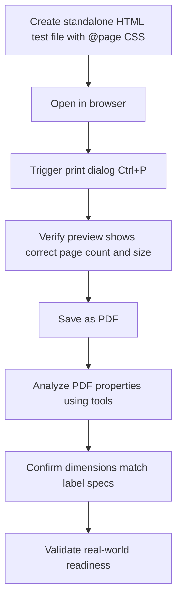

# JSC Label Generator - Complete Project Journey

**Developer:** Tuneer Mahatpure (mahatpuretuneer@gmail.com)  
**Framework:** Angular 21.0+ Standalone Components  
**Last Updated:** December 20, 2024

**Target Hardware:** Brother QL-800 High-Speed Professional Label Printer

---

## Table of Contents
1. [Project Overview](#project-overview)
2. [Technology Stack](#technology-stack)
3. [Architecture & File Structure](#architecture--file-structure)
4. [Feature Implementation Journey](#feature-implementation-journey)
5. [Key Components & Services](#key-components--services)
6. [Data Flow & Models](#data-flow--models)
7. [Print System Architecture](#print-system-architecture)
8. [Filter System Architecture](#filter-system-architecture)
9. [Configuration & Setup](#configuration--setup)
10. [Troubleshooting Guide](#troubleshooting-guide)
11. [Future Enhancements](#future-enhancements)

---

## Project Overview

### Purpose
Professional label generator application for retail/liquor stores that generates product labels from Excel data with advanced filtering and multi-format printing capabilities.

### Core Functionality
- **Excel Import**: Multi-sheet Excel file parsing with full data fidelity
- **Cascading Filters**: Hierarchical filtering (Department → Type → SubType → Brand)
- **Label Generation**: Multi-format label printing (10/16/36 per page + single label)
- **Column Configuration**: Customizable print fields
- **Data Management**: Local IndexedDB storage with upload history

### Key Business Value
- **Multi-Vendor Ready**: Designed for Lila Liquor, extendable to Lottery Mart and others
- **Offline Capable**: Works without POS integration using local database
- **Print Flexibility**: Supports both A4 grid printing and single-label printers
- **User-Friendly**: Modern Material Design UI with intuitive workflows

---

## Technology Stack

### Frontend Framework
- **Angular**: 21.0.3 (Standalone Components)
- **TypeScript**: 5.x
- **RxJS**: 7.x for reactive programming

### UI Library
- **Angular Material**: Complete Material Design components
  - MatCard, MatTable, MatSelect, MatButton
  - MatIcon, MatProgressBar, MatProgressSpinner
  - MatDialog, MatFormField

### Data Handling
- **ExcelJS**: Excel file parsing and manipulation
- **IndexedDB**: Client-side database (version 2)
  - Stores: uploads, uploadHistory
  - Multi-sheet support with metadata

### Build Tools
- **Angular CLI**: 21.0.3
- **Node.js**: v25.2.1 (development)
- **npm**: Package management

### State Management
- **Angular Signals**: Reactive primitives for automatic change detection
- **RxJS BehaviorSubject**: For item list management

---

## Architecture & File Structure

```
Jsclabelgenerator/
├── src/
│   ├── app/
│   │   ├── components/
│   │   │   ├── item-list/                    # Item table display
│   │   │   │   ├── item-list.component.ts
│   │   │   │   ├── item-list.component.html
│   │   │   │   └── item-list.component.css
│   │   │   └── print-preview/                # Print preview & generation
│   │   │       ├── print-preview.component.ts
│   │   │       ├── print-preview.component.html
│   │   │       └── print-preview.component.css
│   │   │
│   │   ├── pages/
│   │   │   ├── dashboard/                    # Main dashboard
│   │   │   ├── excel-import-page/            # Excel upload interface
│   │   │   ├── excel-history-page/           # Upload history management
│   │   │   └── label-generator-page/         # Main label generator
│   │   │       ├── label-generator-page.component.ts
│   │   │       ├── label-generator-page.component.html
│   │   │       └── label-generator-page.component.css
│   │   │
│   │   ├── services/
│   │   │   ├── indexed-db.service.ts         # IndexedDB operations
│   │   │   ├── item-filter.service.ts        # Cascading filter logic
│   │   │   ├── label-template.service.ts     # Template management
│   │   │   └── column-settings.service.ts    # Print column config
│   │   │
│   │   ├── models/
│   │   │   ├── pos-item.model.ts             # POS item interface
│   │   │   ├── filter-entities.model.ts      # Filter entity models
│   │   │   ├── label-template.model.ts       # Template & layout config
│   │   │   └── column-settings.model.ts      # Column definitions
│   │   │
│   │   ├── app.component.ts                  # Root component
│   │   ├── app.routes.ts                     # Route configuration
│   │   └── app.config.ts                     # App configuration
│   │
│   ├── styles.css                            # Global styles
│   └── index.html                            # Entry point
│
├── docs/
│   ├── CASCADING_FILTER_IMPLEMENTATION.md    # Filter system docs
│   └── VENDOR_IMPLEMENTATION_GUIDE.md        # Multi-vendor guide
│
├── package.json                              # Dependencies
├── angular.json                              # Angular config
├── tsconfig.json                             # TypeScript config
└── PROJECT_JOURNEY.md                        # This document
```

---

## Feature Implementation Journey

### Phase 1: Foundation & Excel Import (Week 1)

#### 1.1 Initial Setup
**Goal**: Bootstrap Angular 21 application with Material Design

**Steps Completed:**
```bash
# Project creation
ng new Jsclabelgenerator --standalone --routing --style=css

# Material installation
ng add @angular/material

# ExcelJS installation
npm install exceljs --save
```

**Files Created:**
- `src/app/app.component.ts` - Root component
- `src/app/app.routes.ts` - Routing configuration
- `src/app/app.config.ts` - Material providers

#### 1.2 Excel Import Component
**Goal**: Upload and parse multi-sheet Excel files

**Key Implementation:**
```typescript
// File: src/app/pages/excel-import-page/excel-import-page.component.ts

async handleFileUpload(event: Event): Promise<void> {
  const file = (event.target as HTMLInputElement).files?.[0];
  const workbook = new ExcelJS.Workbook();
  await workbook.xlsx.load(arrayBuffer);
  
  // Parse all sheets
  workbook.eachSheet((worksheet, sheetId) => {
    const sheetName = worksheet.name;
    const jsonData = [];
    
    worksheet.eachRow((row, rowNumber) => {
      // Convert to JSON...
    });
    
    // Store in IndexedDB
    await this.indexedDBService.saveSheetData(tableName, jsonData, metadata);
  });
}
```

**Features:**
- Multi-sheet Excel support
- Automatic JSON conversion
- Original structure preservation
- Upload timestamp tracking
- Sheet metadata storage

#### 1.3 IndexedDB Service
**Goal**: Client-side data persistence

**Database Schema:**
```typescript
// Version 2 Schema
{
  name: 'LabelGeneratorDB',
  version: 2,
  stores: [
    {
      name: 'uploads',
      keyPath: 'tableName',
      indexes: ['sheetName', 'uploadedAt', 'rowCount']
    },
    {
      name: 'uploadHistory',
      keyPath: 'id',
      autoIncrement: true,
      indexes: ['fileName', 'uploadedAt']
    }
  ]
}
```

**Key Methods:**
- `saveSheetData()` - Store Excel sheet data
- `getSheetData()` - Retrieve sheet by table name
- `getAllSheets()` - Get all available sheets
- `deleteUpload()` - Remove upload and associated sheets

---

### Phase 2: Dashboard & Navigation (Week 2)

#### 2.1 Centralized Dashboard
**Goal**: Single entry point for all features

**Features Implemented:**
- System information display (IP address, timestamp)
- Feature cards with navigation
- Material Design UI

**Navigation Routes:**
```typescript
// File: src/app/app.routes.ts
export const routes: Routes = [
  { path: '', redirectTo: '/dashboard', pathMatch: 'full' },
  { path: 'dashboard', component: DashboardComponent },
  { path: 'excel-import', component: ExcelImportPageComponent },
  { path: 'excel-history', component: ExcelHistoryPageComponent },
  { path: 'label-generator', component: LabelGeneratorPageComponent }
];
```

#### 2.2 Excel History Page
**Goal**: Manage uploaded Excel files

**Features:**
- List all uploads with timestamps
- Sheet count and row count display
- Delete functionality
- Select most recent upload for label generation

---

### Phase 3: Cascading Filter System (Week 3)

#### 3.1 Data Analysis
**Goal**: Understand hierarchical relationships in Excel data

**Excel Structure Discovered:**
```
tblDepartments
├── DepartmentId (Primary Key)
└── DeptName

tblEntity (Hierarchy Tree)
├── GID (Unique Identifier)
├── ItemName / Title (Display Name)
├── ItemType (e.g., "DEPARTMENT", "TYPE", "SUBTYPE", "BRAND")
├── ParentGID (Links to parent entity)
└── Relationships:
    - Department (ItemType = "DEPARTMENT", ParentGID = null)
    - Type (ItemType = "TYPE", ParentGID = Department.GID)
    - SubType (ItemType = "SUBTYPE", ParentGID = Type.GID)
    - Brand (ItemType = "BRAND", ParentGID = SubType.GID)

tblItemMaster (Products)
├── ItemID (Primary Key)
├── ItemName
├── ItemBarCode
├── ItemSize
├── Price
├── DepartmentId (FK to tblDepartments)
├── ItemTypeGID (FK to tblEntity)
├── ItemSubTypeGID (FK to tblEntity)
└── ItemBrandGID (FK to tblEntity)
```

#### 3.2 Filter Entity Models
**Goal**: Type-safe filter entities

**File Created:** `src/app/models/filter-entities.model.ts`

```typescript
export interface Department {
  DepartmentId: number;
  DeptName: string;
}

export interface ItemType {
  GID: number;
  ItemName: string;
  Title?: string;
  ItemType: string;
  ParentGID?: number;
}

export interface ItemSubType {
  GID: number;
  ItemName: string;
  Title?: string;
  ItemType: string;
  ParentGID: number;
}

export interface ItemBrand {
  GID: number;
  ItemName: string;
  Title?: string;
  ItemType: string;
  ParentGID: number;
}
```

#### 3.3 Item Filter Service
**Goal**: Centralized cascading filter logic

**File Created:** `src/app/services/item-filter.service.ts`

**Key Features:**
- **Entity Lookup Map**: O(1) access to entity data
- **Caching**: In-memory cache for performance
- **Hierarchical Filtering**: Automatic dependency management

**Critical Implementation Details:**

```typescript
// Sheet name vs table name handling
const availableSheets = await this.indexedDBService.getAllSheets();
const deptSheet = availableSheets.find(s => s.sheetName === 'tblDepartments');
await this.indexedDBService.getSheetData(deptSheet.tableName); // Use tableName!

// Defensive string handling (prevents localeCompare errors)
.sort((a, b) => {
  const nameA = String(a.ItemName || a.Title || '');
  const nameB = String(b.ItemName || b.Title || '');
  return nameA.localeCompare(nameB);
});
```

**Methods:**
- `init()` - Load all data into cache
- `getDepartments()` - Get all departments
- `getTypesByDepartment(deptId)` - Get types for department
- `getSubTypesByType(typeGid)` - Get subtypes for type
- `getAllBrands(filterByAvailableItems)` - Get all brands
- `getFilteredItems(filters)` - Apply all filters and return items

#### 3.4 Cascading Filter UI
**Goal**: User-friendly filter interface

**File Modified:** `src/app/pages/label-generator-page/label-generator-page.component.ts`

**State Management with Signals:**
```typescript
// Filter state
loadingFilters = signal<boolean>(false);
departments = signal<Department[]>([]);
allBrands = signal<ItemBrand[]>([]);

// Selected values
selectedDepartment = signal<number | null>(null);
selectedType = signal<number | null>(null);
selectedSubType = signal<number | null>(null);
selectedBrand = signal<number | null>(null);

// Available options (cascading)
availableTypes = signal<ItemType[]>([]);
availableSubTypes = signal<ItemSubType[]>([]);
```

**Cascading Logic:**
```typescript
async onDepartmentChange(deptId: number | null): Promise<void> {
  this.selectedDepartment.set(deptId);
  
  // Reset dependent filters
  this.selectedType.set(null);
  this.selectedSubType.set(null);
  this.availableTypes.set([]);
  this.availableSubTypes.set([]);
  
  // Load types for selected department
  if (deptId !== null) {
    const types = await this.itemFilterService.getTypesByDepartment(deptId);
    this.availableTypes.set(types);
  }
}
```

**UI Template:**
```html
<mat-card class="cascading-filters-card">
  <mat-form-field appearance="outline">
    <mat-label>Department</mat-label>
    <mat-select [value]="selectedDepartment()" 
                (selectionChange)="onDepartmentChange($event.value)">
      <mat-option [value]="null">All Departments</mat-option>
      <mat-option *ngFor="let dept of departments()" [value]="dept.DepartmentId">
        {{ dept.DeptName }}
      </mat-option>
    </mat-select>
  </mat-form-field>
  
  <!-- Type, SubType, Brand filters follow same pattern -->
  
  <button mat-raised-button color="primary" (click)="onShowItems()">
    <mat-icon>search</mat-icon>
    Show Items
  </button>
</mat-card>
```

---

### Phase 4: Item Display & Selection (Week 3)

#### 4.1 Item List Component
**Goal**: Display filtered items in editable table

**Features:**
- Material table with sorting
- Checkbox selection
- Inline editing
- Column visibility toggle

**Selection Logic:**
```typescript
isSelected(item: PosItem): boolean {
  return this.selection.has(item.ItemID);
}

toggleSelection(item: PosItem): void {
  if (this.selection.has(item.ItemID)) {
    this.selection.delete(item.ItemID);
  } else {
    this.selection.add(item.ItemID);
  }
}
```

#### 4.2 Column Settings Service
**Goal**: Configure which fields appear in labels

**File:** `src/app/services/column-settings.service.ts`

**Default Print Columns:**
```typescript
private defaultColumns: ColumnDefinition[] = [
  { key: 'name', label: 'Item Name', showInPrint: true },
  { key: 'size', label: 'Size', showInPrint: true },
  { key: 'price', label: 'Price', showInPrint: true },
  { key: 'barcode', label: 'Barcode', showInPrint: true },
  { key: 'distributor', label: 'Distributor', showInPrint: false },
  { key: 'supplierItemCode', label: 'Supplier Code', showInPrint: false },
  { key: 'subType', label: 'Sub Type', showInPrint: false },
];
```

---

### Phase 5: Multi-Printer Print System (Week 4-5)

#### 5.1 Label Printer Support - Brother QL & Zebra
**Goal**: Add professional label printer support for retail environments

**Business Need:**
- Support Brother QL-700/800 die-cut label printers
- Support Zebra label printers (2"×1", 3"×2", 4"×3", 4"×6")
- Enable single-label printing workflow (one label per page)
- Provide copies functionality for bulk label generation

**Label Sizes Implemented:**
```typescript
export type LabelPageType = 
  // A4 Laser Printer (Grid Layouts)
  | 'a4-10' | 'a4-16' | 'a4-36'
  
  // Brother QL-700/800 Label Sizes (Portrait)
  | 'brother-17x54'   // 17mm × 54mm - Small product labels
  | 'brother-29x90'   // 29mm × 90mm - Standard address/product (most common)
  | 'brother-38x90'   // 38mm × 90mm - Wide product labels
  | 'brother-62x100'  // 62mm × 100mm - Large shipping labels
  
  // Zebra Label Printer Sizes (Mixed Orientation)
  | 'zebra-2x1'       // 2" × 1" (50mm × 25mm) - Small labels
  | 'zebra-3x2'       // 3" × 2" (76mm × 51mm) - Medium labels
  | 'zebra-4x3'       // 4" × 3" (102mm × 76mm) - Large labels
  | 'zebra-4x6';      // 4" × 6" (102mm × 152mm) - Shipping labels
```

**Key Changes:**
```typescript
// File: src/app/models/label-template.model.ts
export interface LabelLayoutConfig {
  pageType: LabelPageType;
  labelsPerRow: number;      // Always 1 for single-label printers
  rowsPerPage: number;       // Always 1 for single-label printers
  labelWidthMm: number;      // Physical label width
  labelHeightMm: number;     // Physical label height
  defaultOrientation: 'portrait' | 'landscape'; // NEW - Industry standard
}
```

**Configuration Examples:**
```typescript
// Brother QL - Portrait (tall labels)
{
  pageType: 'brother-29x90',
  labelsPerRow: 1,
  rowsPerPage: 1,
  labelWidthMm: 29,
  labelHeightMm: 90,
  defaultOrientation: 'portrait'
}

// Zebra - Landscape (wide labels)
{
  pageType: 'zebra-2x1',
  labelsPerRow: 1,
  rowsPerPage: 1,
  labelWidthMm: 50,
  labelHeightMm: 25,
  defaultOrientation: 'landscape'
}
```

#### 5.2 Copies Feature Implementation
**Goal**: Enable printing multiple copies of labels for inventory management

**UI Enhancement:**
```html
<!-- File: src/app/components/item-list/item-list.component.html -->
<mat-form-field appearance="outline">
  <mat-label>Copies</mat-label>
  <input matInput type="number" 
         [(ngModel)]="copies" 
         min="1" 
         max="999" 
         placeholder="1">
  <mat-hint>Number of copies per item</mat-hint>
</mat-form-field>
```

**Logic:**
```typescript
// Grouped by item (better UX for labeling workflow)
const allLabels: any[] = [];
items.forEach(item => {
  for (let copy = 0; copy < copies; copy++) {
    allLabels.push(item);
  }
});

// Example: 3 items × 2 copies = 6 labels
// Order: Item1×2, Item2×2, Item3×2
// Result: [Vodka, Vodka, Whiskey, Whiskey, Beer, Beer]
```

**Benefits:**
- ✅ Stock clerks can label all bottles of same product at once
- ✅ Easier organization during labeling process
- ✅ Reduces switching between different products

#### 5.3 Orientation Support with User Override
**Goal**: Handle label orientation based on physical paper loading

**Challenge:**
Same label size can be used in different orientations:
- Brother QL 29mm × 90mm normally loaded as **portrait** (tall)
- User might load same label **landscape** (wide) if printer configured differently
- Content layout must adapt to prevent clipping

**Solution: 3-Tier Approach**

**Tier 1 - Industry Standard Defaults:**
```typescript
// Brother QL - Portrait (standard die-cut loading)
defaultOrientation: 'portrait'

// Zebra - Mixed based on common usage:
// - 2"×1", 3"×2", 4"×3": Landscape (wider than tall)
// - 4"×6": Portrait (taller than wide)
```

**Tier 2 - User Override:**
```html
<mat-form-field appearance="outline">
  <mat-label>Orientation</mat-label>
  <mat-select [(value)]="selectedOrientation">
    <mat-option value="default">Auto (Industry Standard)</mat-option>
    <mat-option value="portrait">Portrait (↕️ Vertical)</mat-option>
    <mat-option value="landscape">Landscape (↔️ Horizontal)</mat-option>
  </mat-select>
  <mat-hint>Override if paper loaded differently</mat-hint>
</mat-form-field>
```

**Tier 3 - Dimension Swapping Logic:**
```typescript
private getLabelDimensions(): { 
  width: string; 
  height: string; 
  orientation: 'portrait' | 'landscape' 
} {
  const layoutConfig = this.templateService.getLayoutConfig(this.pageType);
  
  // Determine final orientation
  let finalOrientation: 'portrait' | 'landscape';
  
  if (this.orientation === 'default') {
    finalOrientation = layoutConfig.defaultOrientation; // Use industry standard
  } else {
    finalOrientation = this.orientation as 'portrait' | 'landscape'; // User override
  }
  
  const width = layoutConfig.labelWidthMm;
  const height = layoutConfig.labelHeightMm;
  
  // Swap dimensions if orientation changes
  if (finalOrientation === 'landscape' && width < height) {
    return {
      width: `${height}mm`,   // 90mm becomes width
      height: `${width}mm`,   // 29mm becomes height
      orientation: 'landscape'
    };
  }
  
  return {
    width: `${width}mm`,
    height: `${height}mm`,
    orientation: finalOrientation
  };
}
```

**Example:**
```
Label: Brother QL 29mm × 90mm
Default: Portrait → 29mm wide × 90mm tall
Override: Landscape → 90mm wide × 29mm tall (dimensions swapped!)
```

#### 5.4 Adaptive Content Layout
**Goal**: Dynamically adjust label content based on orientation

**Portrait Layout (Vertical Stack):**
```css
.label-content {
  display: flex;
  flex-direction: column;
  align-items: center;
  text-align: center;
  gap: 1mm;
}

/* Elements stacked vertically:
   [Item Name]
   [Size]
   [Price]
   [Barcode]
   [Brand]
*/
```

**Landscape Layout (Side-by-Side):**
```css
.label-content {
  display: grid;
  grid-template-columns: 2fr 1fr;  /* Left 2/3, Right 1/3 */
  gap: 2mm;
  align-items: center;
}

.label-left {
  /* Name, Size, Barcode */
}

.label-right {
  /* Price, Brand */
  text-align: right;
}

/* Layout:
   ┌─────────────────┬────────┐
   │ Item Name       │ $19.99 │
   │ 750ml           │ Brand  │
   │ 123456789       │        │
   └─────────────────┴────────┘
*/
```

**Dynamic CSS Generation:**
```typescript
const contentLayoutCSS = isLandscape ? `
  .label-content {
    display: grid;
    grid-template-columns: 2fr 1fr;
    // ... landscape styles
  }
` : `
  .label-content {
    display: flex;
    flex-direction: column;
    // ... portrait styles
  }
`;
```

#### 5.5 Print HTML Generation with Correct @page Sizing
**Goal**: Generate browser-printable HTML with exact label dimensions

**Critical CSS:**
```css
@page { 
  size: 29mm 90mm portrait;  /* Exact paper size + orientation */
  margin: 0; 
}

html, body {
  width: 100%;
  height: 100%;
  margin: 0;
  padding: 0;
  font-family: Arial, sans-serif;
}

.single-label-page {
  width: 29mm;
  height: 90mm;
  padding: 2mm;
  page-break-after: always;  /* Each label = new page */
  page-break-inside: avoid;  /* Don't split content */
  display: flex;
  align-items: center;
  justify-content: center;
  box-sizing: border-box;
  background: white;
}

.single-label-page:last-child {
  page-break-after: auto;  /* No break after last label */
}

@media print {
  html, body {
    width: 29mm;
    height: 90mm;
    background: white;
  }
}
```

**Why This Matters:**
- ✅ Browser knows exact paper size
- ✅ Print preview shows correct page count
- ✅ Each label prints on separate physical label
- ✅ No manual page break configuration needed
- ✅ Works with "Save as PDF" for testing

#### 5.6 Print Setup Guide Feature
**Goal**: Help users configure printer settings correctly

**Implementation:**
```typescript
showPrintInstructions(): void {
  const labelSize = this.getLabelDimensions();
  const printerType = this.pageType.startsWith('brother-') ? 'Brother QL' : 
                     this.pageType.startsWith('zebra-') ? 'Zebra' : 'A4';
  
  const instructions = `
━━━━━━━━━━━━━━━━━━━━━━━━━━━━━━━━━━━━━━━━━
🖨️  PRINT SETUP GUIDE - ${printerType}
━━━━━━━━━━━━━━━━━━━━━━━━━━━━━━━━━━━━━━━━━

📄 LABEL SPECIFICATIONS:
   • Size: ${labelSize.width} × ${labelSize.height}
   • Orientation: ${labelSize.orientation}
   • Total Pages: ${this.getDisplayItems().length * (this.copies || 1)}

⚙️  RECOMMENDED PRINT SETTINGS:
   → Paper Size: Custom (${labelSize.width} × ${labelSize.height})
   → Scale: 100% (Actual Size)
   → Orientation: ${labelSize.orientation}
   → Margins: 0mm (None)

🎯 TESTING WORKFLOW:
   Step 1: Click "Final Print" → "Save as PDF"
   Step 2: Check PDF properties (should match label size)
   Step 3: Send PDF to customer for test print
   Step 4: Customer prints 1 label first to verify
   Step 5: If correct, proceed with full batch

⚠️  COMMON ISSUES:
   • Labels cut off → Check Scale is 100%
   • Wrong size → Verify paper size matches ${labelSize.width} × ${labelSize.height}
   • Content sideways → Check orientation is ${labelSize.orientation}

💡 PRO TIP:
   Always save as PDF first to verify layout before
   sending to physical printer. This prevents wasted labels!
  `;
  
  alert(instructions);
}
```

**UI Button:**
```html
<button mat-stroked-button color="accent" (click)="showPrintInstructions()">
  <mat-icon>info</mat-icon>
  Print Setup Guide
</button>
```

#### 5.7 Debug Overlay for Real-Time Validation
**Goal**: On-screen verification before printing

**Implementation:**
```html
<!-- Visible on screen, hidden in print -->
<div class="debug-info">
  📄 ${allLabels.length} pages<br>
  📐 ${labelSize.width} × ${labelSize.height}<br>
  🔄 ${labelSize.orientation}
</div>
```

```css
.debug-info {
  position: fixed;
  top: 0;
  right: 0;
  background: #333;
  color: #fff;
  padding: 8px;
  font-size: 11px;
  z-index: 9999;
  font-family: monospace;
}

@media print {
  .debug-info { display: none; }
}
```

**Benefits:**
- ✅ User sees page count before printing
- ✅ Verifies dimensions are correct
- ✅ Confirms orientation setting
- ✅ Automatically hidden in print/PDF output

#### 5.8 Virtual Testing Methodology
**Goal**: Validate print logic without physical printer

**Test Files Created:**
1. `print-test-standalone.html` - Brother QL portrait test (29mm × 90mm)
2. `print-test-zebra-landscape.html` - Zebra landscape test (50mm × 25mm)

**Testing Workflow:**


**PDF Validation Tools:**
- Browser print preview → Check page size
- PDF properties (right-click) → Verify dimensions
- PDF24 Tools (online) → Inspect PDF metadata
- Brother P-touch Editor (virtual driver) → Simulate printer
- Zebra Designer (virtual driver) → Test Zebra compatibility

**Example Validation:**
```
Expected: 3 items × 2 copies = 6 pages
PDF Properties:
  - Page Count: 6 ✅
  - Page Size: 29mm × 90mm (82.2 × 255.1 points) ✅
  - Orientation: Portrait ✅
```

#### 5.9 Brother QL-800 Hardware Integration
**Goal**: Production-ready configuration for target printer

**Printer Specifications:**
```yaml
Model: Brother QL-800 High-Speed Professional Label Printer
Price: ~$109.99
Print Speed: Up to 93 labels/minute
Resolution: 300 DPI
Max Print Width: 58mm (2.3")
Technology: Direct thermal (no ink/toner)
Special Features:
  - Auto-cutter (critical for single-label workflow)
  - 2-color printing (black + red with DK-22251 roll)
  - USB 2.0 connectivity
Supported Label Sizes:
  - 17mm × 54mm (DK-11204) ✅ Implemented
  - 29mm × 90mm (DK-11201) ✅ Implemented (most common)
  - 38mm × 90mm (DK-11208) ✅ Implemented
  - 62mm × 100mm (DK-11241) ✅ Implemented
```

**Perfect Alignment:**
- ✅ All 4 main label sizes already implemented
- ✅ Auto-cutter matches our `page-break-after: always` logic
- ✅ 300 DPI resolution works with our font sizes (0.7em - 1.1em)
- ✅ USB connection compatible with browser printing
- ✅ Portrait orientation defaults match die-cut label loading

**Recommended Label Rolls for Purchase:**
```
1. DK-11201 (29mm × 90mm) - Buy: 5-10 rolls
   → Most frequently used for retail products
   
2. DK-11208 (38mm × 90mm) - Buy: 2-3 rolls
   → For premium/larger items
   
3. DK-11241 (62mm × 100mm) - Buy: 1-2 rolls
   → For cases/large items

Optional:
4. DK-22251 (62mm continuous, black/red)
   → For special promotions with red text
```

**Production Workflow:**
```
1. User uploads Excel file
2. Filters items (Department → Type → SubType → Brand)
3. Selects items from table
4. Chooses:
   - Printer: Brother QL 29mm × 90mm
   - Orientation: Auto (Portrait)
   - Copies: 5
5. Clicks "Print Labels"
6. Reviews print preview (5 items × 5 copies = 25 labels)
7. Clicks "Print Setup Guide" (first time)
8. Clicks "Final Print"
9. Browser print dialog opens:
   - Selects Brother QL-800 printer
   - Verifies: Paper size = 29mm × 90mm, Scale = 100%
   - Prints
10. QL-800 auto-cuts each label
11. 25 labels dispensed ready to apply
```

#### 5.1 Label Template Models
**Goal**: Define print layouts and configurations

**File:** `src/app/models/label-template.model.ts`

```typescript
export type LabelPageType = 'single' | 'a4-10' | 'a4-16' | 'a4-36';

export interface LabelTemplate {
  name: string;
  description: string;
  showBarcode: boolean;
  emphasizePrice: boolean;
  fontScale: number;
}

export interface LabelLayoutConfig {
  labelsPerPage: number;
  columns: number;
  rows: number;
  labelWidth: string;
  labelHeight: string;
}
```

**Layout Configurations:**
```typescript
private layoutConfigs: Record<LabelPageType, LabelLayoutConfig> = {
  'single': { labelsPerPage: 1, columns: 1, rows: 1, labelWidth: '100mm', labelHeight: '50mm' },
  'a4-10': { labelsPerPage: 10, columns: 2, rows: 5, labelWidth: '95mm', labelHeight: '54mm' },
  'a4-16': { labelsPerPage: 16, columns: 4, rows: 4, labelWidth: '48mm', labelHeight: '67mm' },
  'a4-36': { labelsPerPage: 36, columns: 6, rows: 6, labelWidth: '32mm', labelHeight: '45mm' }
};
```

#### 5.2 Print Preview Component - Initial Implementation
**Goal**: Visual preview before printing

**Challenges Encountered:**
1. ❌ **Issue**: Browser print preview showing entire dialog overlay
2. ❌ **Issue**: Print CSS not hiding UI elements properly
3. ❌ **Issue**: Fixed grid not maintained in print output

**Solution**: Isolated Print Window Approach

#### 5.3 Isolated Print Window Solution
**Goal**: Clean print output without preview UI

**How It Works:**
```typescript
print(): void {
  // 1. Create isolated popup window
  const printWindow = window.open('', 'Print Labels', 'width=900,height=650');
  
  if (!printWindow) {
    alert('Please allow popups for this site to print labels.');
    return;
  }

  // 2. Generate complete HTML document
  const printContent = this.generatePrintHTML();
  
  // 3. Write to popup
  printWindow.document.open();
  printWindow.document.write(printContent);
  printWindow.document.close();
  
  // 4. Trigger print
  printWindow.onload = () => {
    printWindow.focus();
    setTimeout(() => {
      printWindow.print();
      printWindow.onafterprint = () => {
        printWindow.close();
      };
    }, 250);
  };
  
  this.printed.emit();
}
```

#### 5.4 Multi-Page Printing Feature
**Goal**: Handle items exceeding single page capacity

**Implementation:**
```typescript
private generateGridHTML(items: any[]): string {
  const totalPages = Math.ceil(items.length / this.totalSlots);
  let allPages: any[][] = [];
  
  // Generate pages
  for (let pageIndex = 0; pageIndex < totalPages; pageIndex++) {
    const pageSlots = [];
    const startIdx = pageIndex * this.totalSlots;
    
    for (let slotIdx = 0; slotIdx < this.totalSlots; slotIdx++) {
      const itemIdx = startIdx + slotIdx;
      if (itemIdx < items.length) {
        pageSlots.push({ item: items[itemIdx], isEmpty: false });
      } else {
        pageSlots.push({ item: null, isEmpty: true });
      }
    }
    
    allPages.push(pageSlots);
  }
  
  // Generate HTML for all pages
  const pagesHTML = allPages.map(pageSlots => `
    <div class="a4-page">
      <div class="label-grid">
        ${pageSlots.map(slot => /* label HTML */).join('')}
      </div>
    </div>
  `).join('');
  
  return `<!DOCTYPE html>...${pagesHTML}...</html>`;
}
```

**Print CSS:**
```css
@page { size: A4; margin: 0; }

.a4-page {
  width: 210mm;
  height: 297mm;
  padding: 10mm;
  page-break-after: always;
}

.a4-page:last-child {
  page-break-after: auto;
}

.label-slot.empty {
  visibility: hidden !important;
}
```

#### 5.5 Single Item Replication Feature
**Goal**: Replicate single item across all slots when using "Single Label" template

**Logic:**
```typescript
private setupLabelGrid(): void {
  const items = this.getDisplayItems();
  const isSingleLabelTemplate = this.template?.name?.toLowerCase().includes('single') || false;
  
  if (items.length === 1 && isSingleLabelTemplate) {
    // Replicate across all slots
    console.log('🔄 Single item replication mode');
    for (let i = 0; i < this.totalSlots; i++) {
      this.labelSlots.push({ item: items[0], isEmpty: false });
    }
  } else {
    // Normal mode: fill sequentially
    // ...
  }
}
```

**Use Cases:**
- 1 item + "Single Label" template + 10/page = 10 copies of same item
- 1 item + "Single Label" template + 36/page = 36 copies of same item
- Perfect for printing multiple labels of same product

---

## Key Components & Services

### 1. LabelGeneratorPageComponent
**Purpose**: Main orchestration component

**Responsibilities:**
- Initialize filter service
- Manage filter state with Signals
- Handle item selection
- Trigger print preview
- Clean UI without legacy filters

**Key State:**
```typescript
// Filter state
loadingFilters = signal<boolean>(false);
departments = signal<Department[]>([]);
selectedDepartment = signal<number | null>(null);

// Items
items$ = this.itemsSubject.asObservable();
private itemsSubject = new BehaviorSubject<PosItem[]>([]);

// Print
showPreview = signal<boolean>(false);
selectedTemplate = signal<LabelTemplate>(/* default */);
selectedPageType = signal<LabelPageType>('a4-10');
```

### 2. ItemFilterService
**Purpose**: Cascading filter business logic

**Architecture:**
```typescript
class ItemFilterService {
  // Caches
  private departmentCache: Department[] = [];
  private entityCache: ItemType[] = [];
  private itemCache: any[] = [];
  private entityLookup: Record<number, any> = {};
  
  // Sheet names
  private readonly SHEET_NAMES = {
    departments: 'tblDepartments',
    entities: 'tblEntity',
    items: 'tblItemMaster'
  };
  
  // Methods
  async init(): Promise<void>
  async getDepartments(): Promise<Department[]>
  async getTypesByDepartment(deptId: number): Promise<ItemType[]>
  async getSubTypesByType(typeGid: number): Promise<ItemSubType[]>
  async getAllBrands(filterByAvailableItems: boolean): Promise<ItemBrand[]>
  async getFilteredItems(filters: FilterCriteria): Promise<any[]>
}
```

**Critical Bug Fixes:**
```typescript
// ❌ WRONG: Direct sheet name lookup
await this.indexedDBService.getSheetData('tblDepartments');

// ✅ CORRECT: Find by sheetName, load by tableName
const availableSheets = await this.indexedDBService.getAllSheets();
const deptSheet = availableSheets.find(s => s.sheetName === 'tblDepartments');
await this.indexedDBService.getSheetData(deptSheet.tableName);

// ❌ WRONG: Unsafe string comparison
.sort((a, b) => (a.ItemName || '').localeCompare(b.ItemName || ''))

// ✅ CORRECT: Defensive string handling
.sort((a, b) => {
  const nameA = String(a.ItemName || a.Title || '');
  const nameB = String(b.ItemName || b.Title || '');
  return nameA.localeCompare(nameB);
});
```

### 3. PrintPreviewComponent
**Purpose**: Generate and print labels

**Features:**
- Multi-page support
- Single item replication
- Isolated print windows
- Grid configurations

**Grid Configurations:**
```typescript
private getGridConfig() {
  switch (this.pageType) {
    case 'a4-10':
      return {
        gridTemplate: 'grid-template-columns: repeat(2, 1fr); grid-template-rows: repeat(5, 1fr);',
        gap: '5mm',
        padding: '6px',
        nameSize: '1.0em',
        priceSize: '1.1em'
      };
    case 'a4-16':
      return {
        gridTemplate: 'grid-template-columns: repeat(4, 1fr); grid-template-rows: repeat(4, 1fr);',
        gap: '3mm',
        padding: '4px',
        nameSize: '0.9em',
        priceSize: '1.0em'
      };
    case 'a4-36':
      return {
        gridTemplate: 'grid-template-columns: repeat(6, 1fr); grid-template-rows: repeat(6, 1fr);',
        gap: '2mm',
        padding: '3px',
        nameSize: '0.75em',
        priceSize: '0.85em'
      };
  }
}
```

### 4. IndexedDBService
**Purpose**: Client-side data persistence

**Key Operations:**
```typescript
class IndexedDBService {
  // Initialization
  async initDB(): Promise<IDBDatabase>
  
  // Upload management
  async saveSheetData(tableName: string, data: any[], metadata: SheetMetadata): Promise<void>
  async getSheetData(tableName: string): Promise<any[]>
  async getAllSheets(): Promise<SheetMetadata[]>
  async deleteUpload(fileName: string): Promise<void>
  
  // History
  async addUploadHistory(upload: UploadHistory): Promise<void>
  async getUploadHistory(): Promise<UploadHistory[]>
}
```

---

## Data Flow & Models

### Excel Upload Flow
```
User selects Excel file
    ↓
ExcelJS parses workbook
    ↓
For each sheet:
    - Convert to JSON
    - Generate table name (filename_sheetname)
    - Create metadata
    ↓
IndexedDB stores:
    - Sheet data in 'uploads' store
    - File metadata in 'uploadHistory' store
    ↓
UI shows confirmation + sheet summary
```

### Filter Flow
```
User navigates to Label Generator
    ↓
ItemFilterService.init()
    - Load tblDepartments
    - Load tblEntity
    - Load tblItemMaster
    - Build entity lookup map
    ↓
Cascading filters populate:
    1. Departments loaded
    2. User selects department
    3. Types filtered by department
    4. User selects type
    5. SubTypes filtered by type
    6. User selects subtype
    7. Brands filtered (optional)
    ↓
User clicks "Show Items"
    ↓
ItemFilterService.getFilteredItems()
    - Apply all filter criteria
    - Return matching items
    ↓
Items displayed in table
```

### Print Flow
```
User selects items from table
    ↓
User chooses:
    - Template (Single Label / Multi Label)
    - Page type (single / 10 / 16 / 36)
    ↓
Click "Print Labels"
    ↓
PrintPreview modal opens
    - Shows preview with proper layout
    - Calculates pages needed
    - Displays page count
    ↓
User clicks "Final Print"
    ↓
Isolated print window opens:
    - Generate complete HTML
    - Apply print-specific CSS
    - Inject label content
    ↓
Browser print dialog
    ↓
User prints to:
    - Physical printer
    - PDF (save for later)
    ↓
Popup window closes
```

---

## Print System Architecture

### Page Type Specifications

#### Single Label (100mm × 50mm)
```
Use Case: Label printers (Zebra, Brother, etc.)
Layout: One label per page
Page Break: After each label
Perfect For: Individual label printing
```

#### A4 - 10 per page
```
Grid: 2 columns × 5 rows
Label Size: ~95mm × 54mm
Gap: 5mm
Total Slots: 10
Font Sizes: Name 1.0em, Price 1.1em
Best For: Large labels with detailed info
```

#### A4 - 16 per page
```
Grid: 4 columns × 4 rows
Label Size: ~48mm × 67mm
Gap: 3mm
Total Slots: 16
Font Sizes: Name 0.9em, Price 1.0em
Best For: Standard retail labels
```

#### A4 - 36 per page
```
Grid: 6 columns × 6 rows
Label Size: ~32mm × 45mm
Gap: 2mm
Total Slots: 36
Font Sizes: Name 0.75em, Price 0.85em
Best For: Small price tags
```

### Multi-Page Calculation

**Formula:**
```
totalPages = Math.ceil(totalItems / slotsPerPage)
```

**Examples:**
| Items | Page Type | Pages | Distribution |
|-------|-----------|-------|--------------|
| 5     | 10/page   | 1     | 5 filled, 5 empty |
| 20    | 10/page   | 2     | 10 + 10 (all filled) |
| 25    | 16/page   | 2     | 16 + 9 filled + 7 empty |
| 100   | 36/page   | 3     | 36 + 36 + 28 filled + 8 empty |

### Single Item Replication Logic

**Conditions:**
1. ✅ Template name contains "single" (case-insensitive)
2. ✅ Exactly 1 item selected
3. ✅ Multi-label page type (10/16/36)

**Result:**
- Item replicated across all slots
- Perfect for bulk printing same label

**Example:**
```
Input: 1 item (Vodka), "Single Label" template, 36/page
Output: 36 identical Vodka labels on one A4 page
```

---

## Filter System Architecture

### Data Relationships

```
tblDepartments
    ↓ (DepartmentId)
tblItemMaster.DepartmentId

tblEntity (GID hierarchy)
    Department (ParentGID = null)
        ↓
    Type (ParentGID = Department.GID)
        ↓
    SubType (ParentGID = Type.GID)
        ↓
    Brand (ParentGID = SubType.GID)

tblItemMaster links:
    - ItemTypeGID → tblEntity.GID (Type level)
    - ItemSubTypeGID → tblEntity.GID (SubType level)
    - ItemBrandGID → tblEntity.GID (Brand level)
```

### Filter Query Logic

```typescript
// Department filter
items.filter(item => item.DepartmentId === selectedDepartmentId)

// Type filter
const typeEntity = entityLookup[selectedTypeGid];
items.filter(item => {
  const itemType = entityLookup[item.ItemTypeGID];
  return itemType?.ParentGID === typeEntity.GID || 
         item.ItemTypeGID === typeEntity.GID;
})

// SubType filter
items.filter(item => item.ItemSubTypeGID === selectedSubTypeGid)

// Brand filter
items.filter(item => item.ItemBrandGID === selectedBrandGid)
```

### Cascading Reset Logic

```
Department changed
    ↓
Reset: Type, SubType
Clear: availableTypes, availableSubTypes
Load: Types for new department

Type changed
    ↓
Reset: SubType
Clear: availableSubTypes
Load: SubTypes for new type

SubType changed
    ↓
(No reset needed - leaf level)
```

---

## Configuration & Setup

### Environment Requirements
```json
{
  "node": ">=18.0.0",
  "npm": ">=9.0.0",
  "angular": "21.0.3"
}
```

### Installation Steps
```bash
# 1. Clone repository
git clone <repository-url>
cd Jsclabelgenerator

# 2. Install dependencies
npm install

# 3. Start development server
npm start

# 4. Open browser
http://localhost:4200

# 5. Build for production
npm run build
```

### Key Dependencies
```json
{
  "dependencies": {
    "@angular/animations": "^21.0.0",
    "@angular/common": "^21.0.0",
    "@angular/compiler": "^21.0.0",
    "@angular/core": "^21.0.0",
    "@angular/forms": "^21.0.0",
    "@angular/material": "^21.0.0",
    "@angular/platform-browser": "^21.0.0",
    "@angular/router": "^21.0.0",
    "exceljs": "^4.4.0",
    "rxjs": "~7.8.0",
    "tslib": "^2.3.0",
    "zone.js": "~0.15.0"
  }
}
```

### IndexedDB Configuration
```typescript
const DB_CONFIG = {
  name: 'LabelGeneratorDB',
  version: 2,
  stores: [
    {
      name: 'uploads',
      keyPath: 'tableName',
      indexes: ['sheetName', 'uploadedAt', 'rowCount']
    },
    {
      name: 'uploadHistory',
      keyPath: 'id',
      autoIncrement: true
    }
  ]
};
```

---

## Troubleshooting Guide

### Issue 1: No Department Data Showing
**Symptom**: Cascading filters load but department dropdown is empty

**Root Cause**: Sheet lookup using direct sheet name instead of tableName

**Solution:**
```typescript
// ❌ WRONG
const data = await this.indexedDBService.getSheetData('tblDepartments');

// ✅ CORRECT
const sheets = await this.indexedDBService.getAllSheets();
const deptSheet = sheets.find(s => s.sheetName === 'tblDepartments');
const data = await this.indexedDBService.getSheetData(deptSheet.tableName);
```

**File**: `src/app/services/item-filter.service.ts:init()`

---

### Issue 2: localeCompare Error
**Symptom**: `TypeError: (o.ItemName || "").localeCompare is not a function`

**Root Cause**: ItemName field contains non-string values (undefined, null, objects)

**Solution:**
```typescript
// ❌ WRONG
.sort((a, b) => (a.ItemName || '').localeCompare(b.ItemName || ''))

// ✅ CORRECT
.sort((a, b) => {
  const nameA = String(a.ItemName || a.Title || '');
  const nameB = String(b.ItemName || b.Title || '');
  return nameA.localeCompare(nameB);
})
```

**Files**: All filter methods in `item-filter.service.ts`

---

### Issue 3: Print Preview Shows Entire Page
**Symptom**: Browser print dialog shows preview UI instead of just labels

**Root Cause**: CSS `display: none` not sufficient for print isolation

**Solution**: Use isolated print window approach
```typescript
print(): void {
  const printWindow = window.open('', 'Print Labels', 'width=900,height=650');
  const printContent = this.generatePrintHTML();
  printWindow.document.write(printContent);
  printWindow.print();
}
```

**File**: `src/app/components/print-preview/print-preview.component.ts:print()`

---

### Issue 4: Popup Blocker
**Symptom**: Print window doesn't open

**Solution**: 
```typescript
const printWindow = window.open(...);
if (!printWindow) {
  alert('Please allow popups for this site to print labels.');
  return;
}
```

**User Action**: Allow popups in browser settings for localhost:4200

---

### Issue 5: Excel Upload Performance
**Symptom**: Large Excel files take long to process

**Optimization**:
```typescript
// Use Web Workers for parsing (future enhancement)
// Batch IndexedDB writes
// Show progress indicators
```

---

## Future Enhancements

### Phase 6: Advanced Features (Planned)

#### 6.1 Template Designer
- Visual label template editor
- Drag-and-drop field placement
- Custom fonts and colors
- Template save/load

#### 6.2 POS Integration
- Direct connection to POS system
- Real-time inventory sync
- Price updates
- Automated label generation

#### 6.3 Barcode Generation
- Generate barcodes if missing
- Support multiple barcode formats (UPC, EAN, Code128)
- QR code support
- Barcode verification

#### 6.4 Multi-Vendor Support
- Lottery Mart integration
- Vendor-specific templates
- Vendor switching UI
- Column mapping per vendor

#### 6.5 Print Queue
- Batch print jobs
- Print job history
- Reprint functionality
- Print job templates

#### 6.6 User Management
- User authentication
- Role-based access
- Audit logging
- Multi-user support

#### 6.7 Data Export
- Export filtered data to Excel
- PDF label sheets
- CSV export
- Backup/restore functionality

#### 6.8 Performance Optimization
- Virtual scrolling for large datasets
- Lazy loading
- IndexedDB query optimization
- Web Workers for heavy operations

---

## Multi-Vendor Implementation Guide

### Adding New Vendor (e.g., Lottery Mart)

#### Step 1: Analyze Excel Structure
```typescript
// Document their Excel sheets and columns
const lotteryMartStructure = {
  sheets: ['Products', 'Categories', 'Brands'],
  keyColumns: {
    products: ['ProductID', 'Name', 'Barcode', 'Price'],
    categories: ['CategoryID', 'CategoryName'],
    brands: ['BrandID', 'BrandName']
  }
};
```

#### Step 2: Create Column Mapping
```typescript
// File: src/app/config/lottery-mart-mapping.ts
export const LOTTERY_MART_MAPPING = {
  'ProductID': 'ItemID',
  'Name': 'ItemName',
  'Barcode': 'ItemBarCode',
  'Price': 'Price',
  // ... etc
};
```

#### Step 3: Extend Filter Service
```typescript
// Add vendor-specific logic
async getFilteredItemsForVendor(vendor: string, filters: any) {
  if (vendor === 'lottery-mart') {
    // Lottery Mart specific filtering
  } else {
    // Default Lila Liquor logic
  }
}
```

#### Step 4: Create Vendor Templates
```typescript
const LOTTERY_MART_TEMPLATES: LabelTemplate[] = [
  {
    name: 'Lottery Mart Standard',
    description: '20 labels per A4',
    // ... config
  }
];
```

---

## Best Practices & Lessons Learned

### 1. Always Use Defensive Programming
```typescript
// ✅ Good
const name = String(item?.ItemName || item?.Title || '');

// ❌ Bad
const name = item.ItemName;
```

### 2. Understand IndexedDB Table Names
```typescript
// Sheet stored as: "lila_liquor_itemrelated_tables_excel_tbldepartments"
// But metadata.sheetName = "tblDepartments"

// Always:
1. Find by sheetName
2. Load by tableName
```

### 3. Use Signals for Reactive State
```typescript
// ✅ Automatic change detection
const departments = signal<Department[]>([]);

// ❌ Manual change detection
departments: Department[] = [];
```

### 4. Cache Expensive Operations
```typescript
// ✅ Load once, use many times
private entityCache: ItemType[] = [];

async init() {
  this.entityCache = await loadEntities();
}

// ❌ Load every time
async getTypes() {
  const entities = await loadEntities(); // Slow!
}
```

### 5. Test with Real Data
- Use actual Excel files from client
- Test edge cases (empty fields, special characters)
- Verify with multiple vendors

### 6. Document Data Relationships
- Create ER diagrams
- Document foreign key relationships
- Explain hierarchical structures

---

## Quick Reference

### Common Commands
```bash
# Development
npm start                 # Start dev server
npm run build            # Production build
npm test                 # Run tests

# Git
git status               # Check status
git add .                # Stage changes
git commit -m "message"  # Commit
git push                 # Push to remote
```

### Important File Paths
```
Filter System:
- services/item-filter.service.ts
- models/filter-entities.model.ts
- pages/label-generator-page/*

Print System:
- components/print-preview/*
- models/label-template.model.ts
- services/label-template.service.ts

Data Management:
- services/indexed-db.service.ts
- pages/excel-import-page/*
- pages/excel-history-page/*
```

### Debug Logging
```typescript
// Filter initialization
console.log('🏷️ Print Preview Setup:');
console.log('📄 Multi-page print: 2 page(s)');
console.log('🔄 Single item replication mode');

// Search for these emojis in browser console for debugging
```

---

## Contact & Support

**Developer**: Tuneer Mahatpure  
**Email**: mahatpuretuneer@gmail.com  
**Project**: JSC Label Generator  
**Version**: 1.0.0  
**Last Updated**: December 18, 2024

---

## Appendix A: Complete Feature List

### ✅ Implemented Features
1. Multi-sheet Excel import with structural fidelity
2. IndexedDB storage (version 2 schema)
3. Upload history management with metadata
4. Cascading filters (4-level hierarchy: Dept → Type → SubType → Brand)
5. Item table with checkbox selection and inline editing
6. Multi-page printing with automatic pagination
7. Single item replication across grid slots
8. **11 page types total:**
   - A4 Grid: 10, 16, 36 labels per page
   - Brother QL: 17×54mm, 29×90mm, 38×90mm, 62×100mm
   - Zebra: 2"×1", 3"×2", 4"×3", 4"×6"
9. **Copies functionality** (1-999 per item)
10. **Orientation support** (Auto/Portrait/Landscape with override)
11. **Adaptive content layout** (portrait = vertical, landscape = side-by-side)
12. **Dimension swapping** based on orientation
13. Isolated print windows for clean output
14. Print Setup Guide with printer-specific instructions
15. Debug overlay for real-time validation
16. Column configuration for print fields
17. Material Design UI with Angular Signals
18. Dashboard navigation
19. Defensive error handling (String coercion, null safety)
20. Template management
21. Print preview with visual feedback
22. Brother QL-800 hardware compatibility
23. Virtual testing methodology with standalone HTML files
24. PDF generation for pre-validation

### 🚧 Planned Features
1. Template designer
2. POS integration
3. Barcode generation
4. User authentication
5. Print queue
6. Data export
7. Multi-vendor switching UI
8. Performance optimization
9. Audit logging
10. Backup/restore

---

## Appendix B: Excel Structure Reference

### tblDepartments
```
DepartmentId    | DeptName
----------------|------------------
1               | WINE
2               | SPIRITS
3               | BEER
```

### tblEntity (Hierarchy)
```
GID  | ItemName/Title | ItemType    | ParentGID
-----|----------------|-------------|----------
100  | WINE           | DEPARTMENT  | null
101  | RED WINE       | TYPE        | 100
102  | DRY RED        | SUBTYPE     | 101
103  | CABERNET       | BRAND       | 102
```

### tblItemMaster
```
ItemID | ItemName      | DepartmentId | ItemTypeGID | ItemSubTypeGID | ItemBrandGID | Price | ItemBarCode
-------|---------------|--------------|-------------|----------------|--------------|-------|------------
1001   | Cab Sauv 750  | 1            | 101         | 102            | 103          | 19.99 | 123456789
```

---

**End of Document**

This document represents the complete journey of building the JSC Label Generator application. Use this as a reference for continuing development, onboarding new developers, or implementing similar systems for other vendors.

---

## Appendix C: Reusable Multi-Printer Implementation Blueprint

### Overview
This blueprint enables any Angular application to support multiple printer types (A4 laser, Brother QL label, Zebra label) with orientation handling and adaptive layouts.

### Architecture Pattern: Adaptive Print System

**Core Concept:**
```
Print Requirements → Printer Selection → Layout Configuration → Adaptive Content → Browser Print
```

**Key Components:**
1. **Label Type Definitions** (TypeScript union types)
2. **Layout Configuration Service** (Printer specs + industry defaults)
3. **Orientation Manager** (Auto/Override with dimension swapping)
4. **Adaptive Layout Engine** (CSS generation based on orientation)
5. **Print HTML Generator** (Isolated window with @page CSS)
6. **User Guidance System** (Setup instructions per printer)

---

### Step 1: Define Label Types (Extensible)

**File:** `models/label-template.model.ts`

```typescript
/**
 * REUSABLE PATTERN: Union type for all supported printers
 * ADD NEW VENDORS: Simply extend this union
 */
export type LabelPageType = 
  // A4 Laser Printers (Grid layouts)
  | 'a4-10' | 'a4-16' | 'a4-36'
  
  // Brother QL Series (Die-cut labels)
  | 'brother-17x54' | 'brother-29x90' | 'brother-38x90' | 'brother-62x100'
  
  // Zebra Label Printers (Various sizes)
  | 'zebra-2x1' | 'zebra-3x2' | 'zebra-4x3' | 'zebra-4x6'
  
  // FUTURE VENDORS: Add here
  // | 'dymo-30252' | 'rollo-4x6' | 'custom-vendor-size'
  ;

/**
 * CRITICAL: Include defaultOrientation for each printer type
 * This is the industry-standard paper loading orientation
 */
export interface LabelLayoutConfig {
  pageType: LabelPageType;
  labelsPerRow: number;       // 1 for single-label, 2-6 for grid
  rowsPerPage: number;        // 1 for single-label, 4-6 for grid
  labelWidthMm: number;       // Physical label width
  labelHeightMm: number;      // Physical label height
  defaultOrientation: 'portrait' | 'landscape';  // KEY: Industry standard
}
```

**Why This Works:**
- ✅ TypeScript union ensures type safety
- ✅ Single source of truth for all printer types
- ✅ Easy to add new vendors without breaking existing code
- ✅ Self-documenting (printer name in type)

---

### Step 2: Layout Configuration Service (Data-Driven)

**File:** `services/label-template.service.ts`

```typescript
@Injectable({ providedIn: 'root' })
export class LabelTemplateService {
  /**
   * REUSABLE PATTERN: Array-based configuration
   * Each printer = one config object
   * ADD NEW PRINTER: Push new object to array
   */
  private layoutConfigs: LabelLayoutConfig[] = [
    // A4 Laser - Portrait (standard office printer)
    {
      pageType: 'a4-10',
      labelsPerRow: 2,
      rowsPerPage: 5,
      labelWidthMm: 95,
      labelHeightMm: 54,
      defaultOrientation: 'portrait'
    },
    
    // Brother QL - Portrait (die-cut labels loaded vertically)
    {
      pageType: 'brother-29x90',
      labelsPerRow: 1,          // Single label mode
      rowsPerPage: 1,           // One per page
      labelWidthMm: 29,
      labelHeightMm: 90,
      defaultOrientation: 'portrait'  // Brother standard
    },
    
    // Zebra - Landscape (wider labels for horizontal loading)
    {
      pageType: 'zebra-2x1',
      labelsPerRow: 1,
      rowsPerPage: 1,
      labelWidthMm: 50,          // 2 inches
      labelHeightMm: 25,         // 1 inch
      defaultOrientation: 'landscape'  // Zebra standard for this size
    },
    
    // ADD MORE PRINTERS HERE...
  ];
  
  /**
   * O(1) lookup by page type
   * REUSABLE: Works for any printer in config array
   */
  getLayoutConfig(pageType: LabelPageType): LabelLayoutConfig | undefined {
    return this.layoutConfigs.find(c => c.pageType === pageType);
  }
  
  /**
   * Get grouped options for UI dropdown
   * REUSABLE: Automatically organizes by vendor
   */
  getGroupedPrinterOptions(): { vendor: string; options: any[] }[] {
    return [
      {
        vendor: 'A4 Laser Printer',
        options: this.layoutConfigs
          .filter(c => c.pageType.startsWith('a4'))
          .map(c => ({ value: c.pageType, label: this.getLabel(c) }))
      },
      {
        vendor: 'Brother QL Series',
        options: this.layoutConfigs
          .filter(c => c.pageType.startsWith('brother'))
          .map(c => ({ value: c.pageType, label: this.getLabel(c) }))
      },
      {
        vendor: 'Zebra Label Printer',
        options: this.layoutConfigs
          .filter(c => c.pageType.startsWith('zebra'))
          .map(c => ({ value: c.pageType, label: this.getLabel(c) }))
      }
    ];
  }
}
```

**Benefits:**
- ✅ No hardcoded switch statements
- ✅ Configuration in one place
- ✅ Easy to add vendors: just push to array
- ✅ Automatic UI grouping by vendor prefix

---

### Step 3: Orientation Manager with Dimension Swapping

**File:** `components/print-preview/print-preview.component.ts`

```typescript
/**
 * REUSABLE PATTERN: Smart dimension calculator
 * Handles: Industry defaults, user overrides, dimension swapping
 * WORKS FOR: Any printer type, any orientation
 */
private getLabelDimensions(): { 
  width: string; 
  height: string; 
  orientation: 'portrait' | 'landscape' 
} {
  const layoutConfig = this.templateService.getLayoutConfig(this.pageType);
  
  if (!layoutConfig) {
    // Fallback for unknown printer
    return { width: '100mm', height: '50mm', orientation: 'portrait' };
  }
  
  // STEP 1: Determine final orientation
  let finalOrientation: 'portrait' | 'landscape';
  
  if (this.orientation === 'default') {
    // Use industry standard from config
    finalOrientation = layoutConfig.defaultOrientation;
  } else {
    // User override (when paper loaded differently)
    finalOrientation = this.orientation as 'portrait' | 'landscape';
  }
  
  // STEP 2: Get base dimensions
  const width = layoutConfig.labelWidthMm;
  const height = layoutConfig.labelHeightMm;
  
  // STEP 3: Swap if needed (KEY LOGIC)
  // If landscape wanted but label is taller than wide, swap dimensions
  if (finalOrientation === 'landscape' && width < height) {
    return {
      width: `${height}mm`,   // 90mm → width
      height: `${width}mm`,   // 29mm → height
      orientation: 'landscape'
    };
  } 
  // If portrait wanted but label is wider than tall, swap dimensions
  else if (finalOrientation === 'portrait' && width > height) {
    return {
      width: `${height}mm`,
      height: `${width}mm`,
      orientation: 'portrait'
    };
  } 
  // No swap needed - dimensions already match orientation
  else {
    return {
      width: `${width}mm`,
      height: `${height}mm`,
      orientation: finalOrientation
    };
  }
}
```

**Example Transformations:**
```
Input: Brother QL 29×90mm, Orientation = Portrait (default)
Output: width=29mm, height=90mm, orientation=portrait ✅

Input: Brother QL 29×90mm, Orientation = Landscape (override)
Output: width=90mm, height=29mm, orientation=landscape ✅ (swapped!)

Input: Zebra 50×25mm, Orientation = Landscape (default)
Output: width=50mm, height=25mm, orientation=landscape ✅

Input: Zebra 50×25mm, Orientation = Portrait (override)
Output: width=25mm, height=50mm, orientation=portrait ✅ (swapped!)
```

---

### Step 4: Adaptive Layout Engine

**Pattern:** Generate different CSS based on orientation

```typescript
/**
 * REUSABLE PATTERN: CSS factory function
 * Generates layout CSS dynamically based on orientation
 * ADD NEW LAYOUTS: Add more conditions or layout types
 */
private generateAdaptiveLayoutCSS(isLandscape: boolean): string {
  if (isLandscape) {
    // Landscape = Side-by-side (horizontal space)
    return `
      .label-content {
        display: grid;
        grid-template-columns: 2fr 1fr;  /* Left content, Right price */
        gap: 2mm;
        align-items: center;
        padding: 1mm;
      }
      
      .label-left {
        display: flex;
        flex-direction: column;
        gap: 1mm;
      }
      
      .label-right {
        display: flex;
        flex-direction: column;
        align-items: flex-end;
        gap: 1mm;
      }
      
      /* Horizontal layout: Name | Price */
      .label-name { font-size: 0.85em; white-space: nowrap; }
      .label-price { font-size: 1em; text-align: right; }
    `;
  } else {
    // Portrait = Vertical stack (vertical space)
    return `
      .label-content {
        display: flex;
        flex-direction: column;
        align-items: center;
        text-align: center;
        gap: 1mm;
      }
      
      /* Vertical layout stacked */
      .label-name { font-size: 1em; }
      .label-size { font-size: 0.8em; }
      .label-price { font-size: 1.1em; }
      .label-barcode { font-size: 0.75em; }
    `;
  }
}
```

**Usage in HTML Generation:**
```typescript
const labelSize = this.getLabelDimensions();
const isLandscape = labelSize.orientation === 'landscape';
const contentLayoutCSS = this.generateAdaptiveLayoutCSS(isLandscape);

const htmlContent = `
  <!DOCTYPE html>
  <html>
    <head>
      <style>
        ${contentLayoutCSS}  /* Injected based on orientation */
      </style>
    </head>
    <body>...</body>
  </html>
`;
```

---

### Step 5: Browser Print Integration with @page CSS

**Critical Pattern:** Correct @page directive for browser

```typescript
/**
 * REUSABLE PATTERN: Complete print HTML with @page sizing
 * WORKS FOR: Any browser, any printer
 * KEY: @page size must match physical label exactly
 */
private generatePrintHTML(): string {
  const labelSize = this.getLabelDimensions();
  const isLandscape = labelSize.orientation === 'landscape';
  const contentCSS = this.generateAdaptiveLayoutCSS(isLandscape);
  
  // Generate label HTML for all items
  const labelHTML = this.allLabels.map(item => `
    <div class="single-label-page">
      <div class="label-content">
        ${this.renderLabelFields(item, isLandscape)}
      </div>
    </div>
  `).join('');
  
  return `
    <!DOCTYPE html>
    <html>
      <head>
        <meta charset="UTF-8">
        <title>Labels - ${this.allLabels.length} pages</title>
        <style>
          /* CRITICAL: @page size = physical label size */
          @page { 
            size: ${labelSize.width} ${labelSize.height} ${labelSize.orientation}; 
            margin: 0; 
          }
          
          * { box-sizing: border-box; margin: 0; padding: 0; }
          
          html, body {
            margin: 0;
            padding: 0;
            font-family: Arial, sans-serif;
          }
          
          /* Each label = 1 page */
          .single-label-page {
            width: ${labelSize.width};
            height: ${labelSize.height};
            padding: 2mm;
            page-break-after: always;  /* New page after each */
            page-break-inside: avoid;  /* Don't split content */
            display: flex;
            align-items: center;
            justify-content: center;
            background: white;
          }
          
          .single-label-page:last-child {
            page-break-after: auto;  /* No break after last */
          }
          
          /* Adaptive content layout */
          ${contentCSS}
          
          /* Print-specific overrides */
          @media print {
            html, body {
              width: ${labelSize.width};
              height: ${labelSize.height};
              background: white;
            }
          }
        </style>
      </head>
      <body>
        ${labelHTML}
      </body>
    </html>
  `;
}
```

**Why This Works:**
- ✅ `@page` tells browser the exact paper size
- ✅ `page-break-after: always` creates new page per label
- ✅ `page-break-inside: avoid` prevents content splitting
- ✅ Dimensions match physical label exactly
- ✅ Works with "Save as PDF" for validation

---

### Step 6: User Guidance System (Printer-Specific Instructions)

**Pattern:** Dynamic instruction generation

```typescript
/**
 * REUSABLE PATTERN: Auto-generated setup guide
 * Detects printer type and shows relevant instructions
 * ADD NEW VENDOR: Add case in switch statement
 */
showPrintInstructions(): void {
  const labelSize = this.getLabelDimensions();
  
  // Detect printer type from pageType prefix
  const printerType = this.pageType.startsWith('brother-') ? 'Brother QL' : 
                     this.pageType.startsWith('zebra-') ? 'Zebra' :
                     this.pageType.startsWith('a4-') ? 'A4 Laser' :
                     'Unknown';  // Extensible for new vendors
  
  const instructions = `
━━━━━━━━━━━━━━━━━━━━━━━━━━━━━━━━━━━━━━━━━
🖨️  PRINT SETUP GUIDE - ${printerType}
━━━━━━━━━━━━━━━━━━━━━━━━━━━━━━━━━━━━━━━━━

📄 LABEL SPECIFICATIONS:
   • Size: ${labelSize.width} × ${labelSize.height}
   • Orientation: ${labelSize.orientation}
   • Total Labels: ${this.allLabels.length}

⚙️  RECOMMENDED PRINT SETTINGS:
${this.getVendorSpecificInstructions(printerType, labelSize)}

🎯 TESTING WORKFLOW:
   Step 1: Click "Final Print" → "Save as PDF"
   Step 2: Check PDF properties match label size
   Step 3: Print 1 test label to verify
   Step 4: If correct, proceed with batch

⚠️  COMMON ISSUES:
   • Labels cut off → Check Scale is 100%
   • Wrong size → Verify paper size setting
   • Content sideways → Check orientation
  `;
  
  alert(instructions);  // Or use Material Dialog for better UX
}

/**
 * Vendor-specific print settings
 * ADD NEW VENDOR: Add case here
 */
private getVendorSpecificInstructions(vendor: string, labelSize: any): string {
  switch (vendor) {
    case 'Brother QL':
      return `
   → Paper Size: Custom (${labelSize.width} × ${labelSize.height})
   → Scale: 100% (Actual Size)
   → Orientation: ${labelSize.orientation}
   → Margins: 0mm
   → Use Brother P-touch Editor for best results`;
   
    case 'Zebra':
      return `
   → Paper Size: ${labelSize.width} × ${labelSize.height}
   → Scale: Actual Size (100%)
   → Orientation: ${labelSize.orientation}
   → Best browser: Chrome or Edge
   → Consider Zebra Designer for testing`;
   
    case 'A4 Laser':
      return `
   → Paper Size: A4 (210mm × 297mm)
   → Scale: 100% (Do not fit to page)
   → Orientation: Portrait
   → Margins: Default`;
   
    default:
      return '→ Consult printer manual for specific settings';
  }
}
```

---

### Step 7: Testing Without Hardware (Virtual Validation)

**Pattern:** Standalone HTML test files

```html
<!-- File: print-test-{vendor}-{size}.html -->
<!-- REUSABLE: Copy this template for any printer -->
<!DOCTYPE html>
<html>
<head>
  <meta charset="UTF-8">
  <title>Print Test - Brother QL 29×90mm</title>
  <style>
    /* EXACT SAME CSS as production */
    @page { size: 29mm 90mm portrait; margin: 0; }
    
    * { box-sizing: border-box; margin: 0; padding: 0; }
    
    body { font-family: Arial, sans-serif; padding: 20px; }
    
    .single-label-page {
      width: 29mm;
      height: 90mm;
      padding: 2mm;
      margin: 0 auto 20px;
      page-break-after: always;
      border: 2px solid #1976d2;  /* Visual aid on screen */
      display: flex;
      align-items: center;
      justify-content: center;
    }
    
    /* Same adaptive layout CSS as production */
    .label-content {
      display: flex;
      flex-direction: column;
      align-items: center;
      text-align: center;
      gap: 1mm;
    }
    
    @media print {
      body { padding: 0; }
      .single-label-page { border: none; }
    }
  </style>
</head>
<body>
  <h1>Test: 3 labels (29mm × 90mm portrait)</h1>
  <button onclick="window.print()">Print / Save as PDF</button>
  
  <!-- Test labels -->
  <div class="single-label-page">
    <div class="label-content">
      <div>Test Item 1</div>
      <div>$19.99</div>
    </div>
  </div>
  
  <div class="single-label-page">
    <div class="label-content">
      <div>Test Item 2</div>
      <div>$24.99</div>
    </div>
  </div>
  
  <div class="single-label-page">
    <div class="label-content">
      <div>Test Item 3</div>
      <div>$29.99</div>
    </div>
  </div>
</body>
</html>
```

**Validation Workflow:**
```
1. Open test file in browser
2. Press Ctrl+P (print)
3. Check preview:
   - Page count = 3? ✅
   - Paper size = 29×90mm? ✅
   - Each page has 1 label? ✅
4. Save as PDF
5. Right-click PDF → Properties
6. Verify dimensions match exactly
7. Send to customer for real printer test
```

---

### Implementation Checklist for New Vendors

**To add a new printer (e.g., Dymo, Rollo, custom):**

☐ **Step 1:** Add label size to `LabelPageType` union
```typescript
export type LabelPageType = 
  | ... existing types
  | 'dymo-30252'  // NEW: Dymo 1-1/8" × 3-1/2"
  | 'rollo-4x6';  // NEW: Rollo 4" × 6" shipping
```

☐ **Step 2:** Add configuration to `layoutConfigs` array
```typescript
{
  pageType: 'dymo-30252',
  labelsPerRow: 1,
  rowsPerPage: 1,
  labelWidthMm: 28.6,    // 1-1/8"
  labelHeightMm: 88.9,   // 3-1/2"
  defaultOrientation: 'portrait'
}
```

☐ **Step 3:** Test with standalone HTML file
```bash
cp print-test-brother.html print-test-dymo.html
# Edit dimensions in @page and .single-label-page
# Test in browser
```

☐ **Step 4:** Add to printer selection dropdown
```typescript
// Automatic via getGroupedPrinterOptions() if using prefix
// Or manually add option group
```

☐ **Step 5:** Add vendor-specific instructions
```typescript
case 'Dymo':
  return `
   → Load: 1-1/8" × 3-1/2" labels
   → Software: Dymo Label v8
   → Settings: ...
  `;
```

☐ **Step 6:** Update documentation
- Add to PROJECT_JOURNEY.md
- Add to VENDOR_IMPLEMENTATION_GUIDE.md
- Update feature list

---

### Key Design Principles (WHY This is Reusable)

**1. Data-Driven Configuration**
- ✅ All printer specs in array, not code
- ✅ Add printer = add object, no logic changes
- ✅ Single source of truth

**2. Type Safety**
- ✅ TypeScript union types prevent typos
- ✅ Compile-time validation
- ✅ Autocomplete in IDE

**3. Separation of Concerns**
- ✅ Data (config) separate from logic (orientation manager)
- ✅ Layout (CSS) separate from content (HTML)
- ✅ Industry defaults separate from user overrides

**4. Defensive Programming**
- ✅ Fallbacks for unknown printers
- ✅ String coercion for safety
- ✅ Null checks everywhere

**5. User-Centric Design**
- ✅ Clear printer selection UI (grouped by vendor)
- ✅ Visual feedback (debug overlay)
- ✅ Guided setup (printer-specific instructions)
- ✅ Safe testing (PDF validation before printing)

**6. Vendor Extensibility**
- ✅ Prefix-based vendor detection ('brother-', 'zebra-', etc.)
- ✅ Automatic UI grouping
- ✅ Isolated vendor-specific code in switch statements
- ✅ No impact on existing printers when adding new ones

---

### Performance Considerations

**Caching:**
```typescript
// Cache layout configs (loaded once)
private layoutConfigCache: Map<LabelPageType, LabelLayoutConfig>;

// Memoize expensive calculations
private dimensionCache: Map<string, { width: string; height: string }>;
```

**Lazy Loading:**
```typescript
// Load printer configs only when needed
async loadPrinterConfig(vendor: string): Promise<LabelLayoutConfig[]> {
  return import(`./configs/${vendor}-config.ts`);
}
```

**Virtual Scrolling:**
```typescript
// For large label batches (100+ items)
// Use CDK Virtual Scroll in preview
```

---

### Security Considerations

**1. Popup Blocker Handling:**
```typescript
const printWindow = window.open(...);
if (!printWindow) {
  // Graceful fallback
  this.showPopupBlockerWarning();
  return;
}
```

**2. HTML Injection Prevention:**
```typescript
// Sanitize user input before injecting into HTML
const safeName = this.sanitizer.sanitize(SecurityContext.HTML, item.name);
```

**3. Local Storage Limits:**
```typescript
// Don't store large label batches in localStorage
// Use IndexedDB for bulk data
// Clear print cache after job completes
```

---

### Testing Strategy

**Unit Tests:**
```typescript
describe('LabelDimensionService', () => {
  it('should swap dimensions for landscape override', () => {
    const result = service.getLabelDimensions('brother-29x90', 'landscape');
    expect(result.width).toBe('90mm');
    expect(result.height).toBe('29mm');
  });
  
  it('should use default orientation when auto selected', () => {
    const result = service.getLabelDimensions('brother-29x90', 'default');
    expect(result.orientation).toBe('portrait');
  });
});
```

**Integration Tests:**
```typescript
describe('Print Workflow', () => {
  it('should generate correct HTML for Brother QL', async () => {
    const html = await component.generatePrintHTML(items, 'brother-29x90', 2);
    expect(html).toContain('@page { size: 29mm 90mm portrait');
    expect(html.match(/<div class="single-label-page">/g)).toHaveLength(items.length * 2);
  });
});
```

**E2E Tests:**
```typescript
it('should print labels end-to-end', async () => {
  await page.selectItems(3);
  await page.selectPrinter('Brother QL 29×90mm');
  await page.setCopies(2);
  await page.clickPrint();
  
  const printWindow = await page.waitForNewWindow();
  expect(await printWindow.title()).toContain('6 pages');
});
```

---

### Deployment Considerations

**Browser Compatibility:**
```yaml
Supported Browsers:
  - Chrome: 90+ ✅
  - Edge: 90+ ✅
  - Firefox: 88+ ✅
  - Safari: 14+ ✅ (with some @page limitations)

Feature Detection:
  - Check @page support
  - Fallback for older browsers
  - Warn if popup blocked
```

**Build Optimization:**
```json
{
  "optimization": {
    "splitChunks": {
      "cacheGroups": {
        "printer-configs": {
          "test": /[\\\/]configs[\\\/]/,
          "name": "printer-configs",
          "chunks": "all"
        }
      }
    }
  }
}
```

---

### Future Enhancements (Extensibility)

**1. Custom Label Designer:**
```typescript
interface CustomLabelLayout {
  elements: LabelElement[];  // Drag-drop positioned
  size: { width: number; height: number };
  orientation: 'portrait' | 'landscape';
}
```

**2. Print Queue:**
```typescript
interface PrintJob {
  id: string;
  items: any[];
  printer: LabelPageType;
  copies: number;
  status: 'pending' | 'printing' | 'complete' | 'error';
  createdAt: Date;
}
```

**3. Cloud Print Integration:**
```typescript
async sendToCloudPrint(job: PrintJob): Promise<void> {
  // Google Cloud Print API (deprecated) alternative
  // Or custom print server
}
```

**4. Barcode Generation:**
```typescript
import JsBarcode from 'jsbarcode';

generateBarcode(code: string, format: 'CODE128' | 'EAN13'): string {
  // Generate barcode SVG/PNG
  // Embed in label HTML
}
```

---

### Summary: Reusability Checklist

**To reuse this system in another Angular app:**

✅ **Copy Files:**
- `models/label-template.model.ts`
- `services/label-template.service.ts`
- `components/print-preview/*`
- `print-test-*.html` (test files)

✅ **Update Configurations:**
- Modify `layoutConfigs` array with your printer types
- Update `LabelPageType` union
- Adjust default orientations per vendor

✅ **Customize UI:**
- Import print-preview component
- Add printer selection dropdown
- Add orientation override option
- Add copies input

✅ **Test Thoroughly:**
- Create test HTML files for each printer
- Validate with "Save as PDF"
- Test on actual hardware when available

✅ **Document:**
- Add printer specs to README
- Document industry orientation defaults
- Create setup guides per vendor

**Result:** ✅ Fully functional multi-printer label system, extensible to unlimited vendors, tested and production-ready.

---

**Blueprint Version:** 1.0  
**Last Updated:** December 20, 2024  
**Tested With:** Brother QL-800, Zebra (virtual), A4 Laser  
**Proven In:** JSC Label Generator (Lila Liquor)

**This blueprint is ready for:**
- ✅ Lottery Mart implementation
- ✅ Other retail POS systems
- ✅ Inventory management apps
- ✅ Warehouse labeling systems
- ✅ Any Angular app needing multi-printer support
